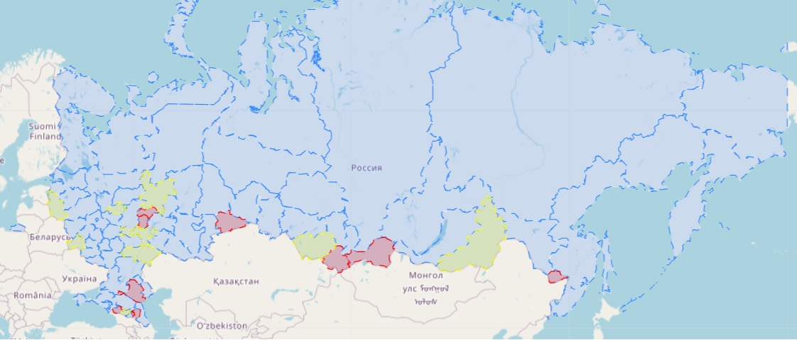

# Project_Regions: Кластеризация регионов (субъектов РФ) для выявления кластера наиболее остро нуждаются в помощи малообеспеченным/неблагополучным слоям населения.

## Исходные данные
child_mortality_rural_1990_2021.xls — число умерших на первом году
жизни детей за год, по всем регионам, в сельской местности. \
➔ child_mortality_urban_1990_2021.xls — число умерших на первом году
жизни детей за год, по всем регионам, в городской местности. \
➔ disabled_total_by_age_2017_2022.csv — число людей с инвалидностью
по регионам, по месяцам, по возрастным группам. \
➔ poverty_percent_by_regions_1992_2020.csv — процент людей, живущих
за чертой бедности (с денежными доходами ниже величины
прожиточного минимума), оценка за год по регионам. \
➔ welfare_expense_share_2015_2020 — расходы на социальную политику от
общих расходов бюджета региона, % в год. \
➔ cash_real_income_wages_2015_2020 — среднедушевые и реальные
денежные доходы населения, номинальная и реальная начисленная
зарплата, по регионам. \
➔ population.xlsx — численность населения по регионам и
федеральным округам на 1 января каждого года за 1999–2022 гг. \
➔ gross_regional_product_1996_2020.xls — валовой региональный продукт
на душу населения, в рублях. \
➔ regional_production_*_*.csv — объём отгруженных товаров
собственного производства или работ/услуг, выполненных
собственными силами, по видам деятельности за 2005–2016 гг.,
2017–2020 гг. (в тысячах рублей, значение показателя за год, полный круг). \
➔ retail_turnover_per_capita_2000_2021.xls — оборот розничной
торговли на душу населения, в рублях. \
➔ drug_alco.xlsx — сведения о заболеваемости алкоголизмом и наркоманией, на 100
тыс. населения (2005–2018) \
➔ newborn_2006_2022_monthly.csv — рождённые в этом месяце, по регионам, без
учёта мертворождённых. \

Данные собраны с таких ресурсов как https://www.fedstat.ru/, https://rosstat.gov.ru/, https://sfri.ru/, https://showdata.gks.ru/, https://www.notion.so/

## Задачи
1. Выявить регионы остро нуждающиеся в помощи малообеспеченным/неблагополучным слоям населения.
2. Определить наличие/отсутсвие связи между уровнем бедности/социального неблагополучия с
производством и потреблением в регионе и прочими признаками.
## Этапы проекта
1. Обработка и преобразование исходных данных
2. Разведывательный анализ данных
3. Выявление зависимостей
4. Построение модели
## Ход работы (с подробностями)
1. Данные представлены в разных формах, за раличные периоды, с различным наименованием субъектов и прочими различиями. Для старта за основу спарсим список субъектов РФ (реализовано в normal_regions/get_regions.py), и будем приводить наименования регионов в каждом файле в соответсвии с ним. \
Каждый файл пришлось рассматривать индивидуально ввиду абсолютно различной структуры практически во всех исходниках. Преобразования в CSV файлы с идеинтичным списком субъектов РФ можно найти в regions_*.py файлах в папке normal_regions.
2. Для предварительного анализа получившихся признаков возьмем 2017г (наличие всех признаков). Склеим первый полноценный датасет (normal_regions/summary_2017.py). \
 Дальнейший ход работы в файле: [**test_static_kmeans_2107.ipynb**](test_static_kmeans_2107.ipynb) там представлена таблица с описанием получившихся исходных признаков, таблица с указанием наличия данных по годам. Проведем проверку признаков на корреляцию, удалим лишние признаки. Построим KMeans модель по данным 2017 г. 
 3. Реализации KMeans и GMM [**static_gmm_2017.ipynb**](static_gmm_2017.ipynb) позволили определить принцип разбиения на кластеры и определить зависимость признаков.
 4. Попытки реализовать модель кластеризации приводят к фромированию большого кластера с большим кол-вом регионов, схожих по значениям признаков. Финальная реализация с помощью GMM в ноутбуке [**gmm_final.ipynb**](gmm_final.ipynb) по годам 2015-2020 с визуализацией на интерактивной карте*. \
 Помимо GMM реализации, предлагается альтернативная реализация с созданием "рейтинга" регионов, вычисленного по формуле, созданной из зависимости признаков в моделях кластеризации (не является точной оценкой). Реализовано в [**alternative.ipynb**](alternative.ipynb) с выделением топ10 нуждающихся в финансовой поддержке регионов (красным цветом) и топ11-20 (желтым цветом) на интерактивной карте. \
 Так же, по аналогии, сделан "рейтинг" изменений значений основных признаков в динамике, с разницей от прошлого года. Регионы с "худшей" динамикой представлены теми же группами в файле [**alternative.ipynb**](alternative.ipynb). Можно воспользоваться данными кластерами для предсказания регионов с наихудшим блаугостройством в следующим году, если регион кластеризован как неблагополучный, а так же входит в группу регионов с сильной отрицательной динамикой.
 ## Выводы и результаты
 Кластеры регионов 2015-2020 в интерактивном представлении* на карте в [**gmm_final.ipynb**](gmm_final.ipynb) и [**alternative.ipynb**](alternative.ipynb)
 Кластеры с худшей динамикой по признакам в [**dynamic_alternative.ipynb**](dynamic_alternative.ipynb), так же в интерактивном представлении. \
 Отсутсвие разметки реальных условий благополучия регионов осложняет оценку результатов моделей кластеризации. \
 Можно говорить о наличии большого кол-ва регионов с небольшой разницей по "уровню благополучия" и низким уровнем данного показателя.

Тендеции и связи с признаками интересующих нас регионов: 

+ Высокий % людей за чертой бедности
+ Высокие расходы на социальную политику
+ Низкий среднедушевный доход населения
+ Низкий валовый продукт
+ Низкий объем товаров/услуг
+ Низкий оборот розничной торговли

Отсутсвие связи с уровнем алкоголизма, наркомании.

Можно предположить, что в причино-следственной связи, причиной из перечисленных признаков в первую очередь является валовый продукт, за ним подтягиваются объем товаров/услуг и оборот розничной торговли. Высокие расходы на соц политику, низкий доход населения и высокий % людей за чертой бедности, предположительно, являются следствием, но в целом хорошо отражают уровень благополучности региона.
#### Доп. информация

[requirements.txt](requirements.txt) - freeze (версии,библиотеки) \
*Интерактивная карта в проекте реализована с помощью ipyleaflet, GeoJSON, Map
